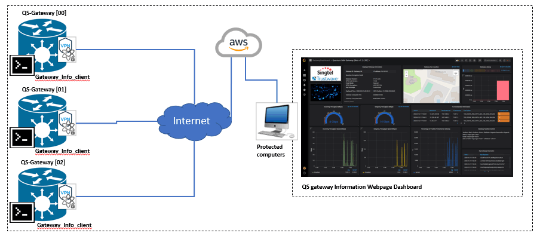

#  Quantum Safe Gateway Information Dashboard

**Program Design Purpose**: We want to create two dashboard programs ( executable application and webpage) to visualize the quantum safe gateway/VPN's running status such as `client own information`, `device geolocation`, `incoming/outgoing throughput speed` and `connection protocol details`.

[TOC]

### Introduction

This project is used to create two kinds of dashboard for users to monitor the dashboard execution detail information. The related gateway information contents device own related information, connected peers gateway information, incoming/outgoing throughput speed, percentage of network packets protected by current gateway, gateway geo-location on the google map. 

- **Application dashboard** : The application dashboard is built by `Wxpython` and running as an executable program on the local computer connected to/ protected by the quantum safe gateway/VPN.
- **Webpage dashboard** : The webpage dashboard is built under the `Grafana` dashboard and running in the hub-server/AWS for admin user/developer to monitor all the quantum gateways deployed to the customers. 

#### Dashboard Main UI View

Webpage dashboard user interface view : 


Application dashboard user interface view : 


`version v_2.1` 


------

### Program/System Design

The system contents four parts of program: 

- **Gateway client** : The gateway data collection program running on the quantum safe gateway/VPN terminal/device to upload the gateway information to the Application-dashboard or the AWS/server database. 
- **Gateway  server** :  A server program with a database, it can be invoked by the Application-dashboard or running individually as a back end in the net server (AWS) to store the gateways' data in database. 
- **Application-dashboard** : Data visualization dashboard application running on the client side. 
- **Webpage-dashboard** : Data visualization dashboard webhost front end running on the server side. 


#### Webpage Dashboard Design 

The webpage dashboard is built under the `Grafana` dashboard and running in the hub server/AWS for admin user/developer to monitor all the quantum gateways deployed to customers.  The network topology diagram is shown below:



##### Webpage Interface Design 

The user interface are built with several components panel, the panels layout will follow below table:

| Dashboard Title                       | Dashboard gateway name/version        |                                                   |                                |
| ------------------------------------- | ------------------------------------- | ------------------------------------------------- | ------------------------------ |
| Logo                                  | Gateway own information panel         | Gateway geo-location display map panel            | Gateway latency display panel  |
| Incoming throughput gauge             | Outgoing throughput gauge             | TLS connection protocol information display panel | Gateway function control panel |
| Incoming throughput speed chart panel | Outgoing throughput speed chart panel | Percentage of packets protected display panel     | Key exchange information panel |


#### Application Dashboard Design

The application dashboard is built by `Wxpython` and running as an executable program on the local computer connected to/ protected by the quantum safe gateway. The gateway client will collect the gateway information and upload the data to the server program then display by dashboard program. The network topology diagram is shown below: 


##### Application Dashboard Interface Design 

The user interface are built with several components panel, the panels layout will follow below table:

| Logo                               | Gateway title(version)                |                                               |                                                         |
| ---------------------------------- | ------------------------------------- | --------------------------------------------- | ------------------------------------------------------- |
| Dashboard server information panel | Deployed gateway information table    |                                               |                                                         |
| Gateway client information panel   | Incoming throughput speed chart panel | Percentage of packets protected display panel | Average percentage of packets protected pie chart panel |
| Gateway function control panel     | Outgoing throughput speed chart panel | Gateway geo-location display map panel        |                                                         |
| TLS connection detail panel        |                                       |                                               |                                                         |


------

### Program Setup

###### Development env 

Python3.7.4, HTML+flask, Grafana Dashboard, InfluxDB.

###### Additional Lib need [Application dashboard]  

1. **wxPython** : https://docs.wxpython.org/index.html

   ```
   Install: pip install wxPython
   ```


###### Additional Lib need [Webpage dashboard] 

1. python Flask :

   ```
   pip install Flask
   ```

2. influxDB : 

   >Download link : https://portal.influxdata.com/downloads/
   >
   >Run : influxd.exe

   ```
   pip install influxdb
   ```

3. Grafana dashboard : 

   > Download link : https://grafana.com/grafana/download?platform=windows

   Change the config files(C:\Program Files\GrafanaLabs\grafana\conf\) to enable the HTML:

   ```
       file: custom.ini
       [panels]
       # If set to true Grafana will allow script tags in text panels. Not recommended as it enable XSS vulnerabilities.
       disable_sanitize_html = true
   
       file: default.ini
       [panels]
       # here for to support old env variables, can remove after a few months
       enable_alpha = false
       disable_sanitize_html = true
   ```

4. Install needed Grafana plugin : 

   > - how to install grafana plug in : 
   >
   >   cd to: C:\Program Files\GrafanaLabs\grafana\bin and run grafana-cli.exe
   >
   > - Install the worldmap Panel: 
   >
   >   https://grafana.com/grafana/plugins/grafana-worldmap-panel/installation
   >
   > - Install AJAX panel to support javascript : 
   >
   >   https://grafana.com/grafana/plugins/ryantxu-ajax-panel/installation
   >
   > - Install trackmap panel : 
   >
   >   https://grafana.com/grafana/plugins/pr0ps-trackmap-panel/installation
   >
   > - Install Boom Theme Panel(optional) :
   >
   >   https://grafana.com/grafana/plugins/yesoreyeram-boomtheme-panel
   >
   > - Install clock panel:
   >
   >   https://grafana.com/grafana/plugins/grafana-clock-panel/installation
   >
   > - Install HTML panel:
   >
   >   https://grafana.com/grafana/plugins/aidanmountford-html-panel
   >
   > - 
   >

5. Set the Grafana account and log the dashboard : 

   > - Set the account(username/password), default is admin/admin:  
   >
   >   admin account:  admin/123123 
   >
   >   viewer account: view/view
   >
   > - Select "Import" in the "Create" tab and upload the latest json file from the folder "grafanaJson"


###### Program File List 

| Program File       | Execution Env | Description                                                  |
| ------------------ | ------------- | ------------------------------------------------------------ |
| src/grafanaDshJson | JSON          | Grafana gateway UI configuration JSON file.                  |
| src/gwLatency/*py  | python3       | Gateway latency measurement program.                         |
| src/img/*          |               | All the image file used by the application dashboard program. |
| src/influxDB/*.py  | python 3      | InfluxDB interface program.                                  |
| src/webDashBoard/* | python 3      | Web page dashboard backend program.                          |
| src/.py            | python 3      | Application dashboard program.                               |
| src/*.json         |               | Simulation data.                                             |


------

### Program Usage

#### Program Execution 

Application dashboard : 

```
Gateway client: python gwClient.py
Monitor computer: python gwDashboardRun.py
```

Webpage dashboard : 

```
Hubserver: 
1. Gateway client: python gwWebClient.py
2. Run grafana 
3. Run the web host client: python controlHost.py
4. Open browser and type in url:  http://localhost:8080/ or <host url/IP>:8080/
```


------

### Problem and Solution

Refer to `doc/ProblemAndSolution.md`


------

### Reference link

Grafana dashboard: https://grafana.com/

InfluxDB: https://www.influxdata.com/


------

> Last edit by LiuYuancheng(liu_yuan_cheng@hotmail.com) at 14/01/2022

