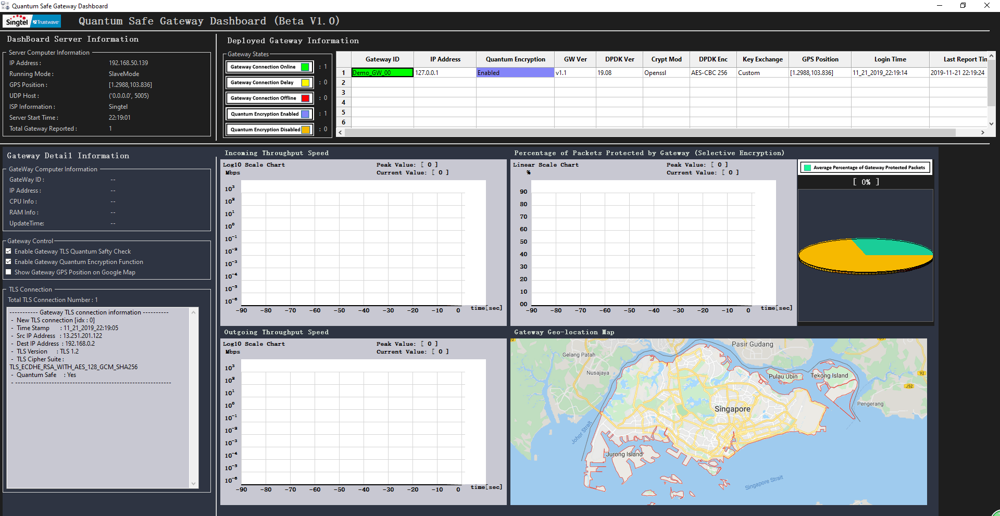
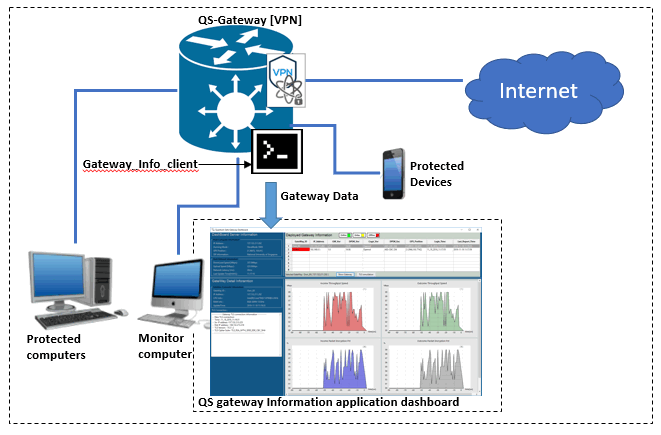

# Quantum Safe Gateway Information Dashboard

**Program Design Purpose**: We want to create two dashboard program ( executable application and web) to visualize the quantum safe gateway's running status such as own information, device geolocation, incoming/outgoing throughput speed, connection protocol details.

[TOC]

### Introduction

This project is used to create two kinds of dashboard for user to monitor the dashboard execution detail information. The related gateway information contents own related information, connected gateway information, incoming/outgoing through put speed, percentage of network packets protected by current gateway, gateway geo-location on the google map. 

- **Application dashboard** : The application dashboard is built by `Wxpython` and running as an executable program on the local computer connected to/ protected by the quantum safe gateway.
- **Webpage dashboard** : The webpage dashboard is built under the `Grafana` dashboard and running in the server hub for admin user/developer to monitor all the quantum gateway deployed to customers. 

#### Dashboard Main UI View

Webpage dashboard user interface view 

Application dashboard user interface view

`version v_2.1` 

------

### Program/System Design

#### Application Dashboard Design

The application dashboard is built by `Wxpython` and running as an executable program on the local computer connected to/ protected by the quantum safe gateway. The gateway data collect client will collect the gateway information and upload the data to the dashboard program. The network topology diagram is shown below: 

##### Interface Design 

WebBase Mode: 

------

### 